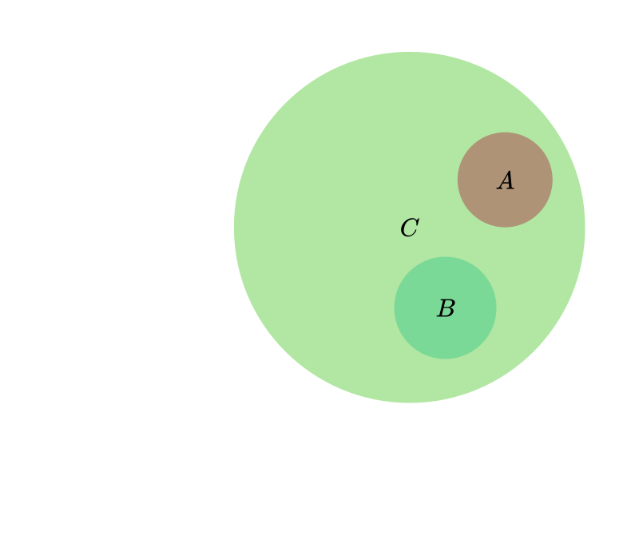
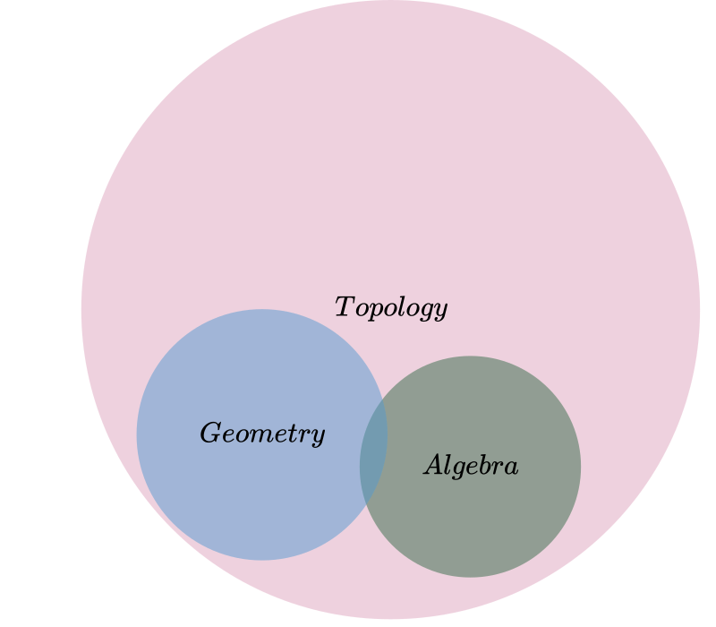
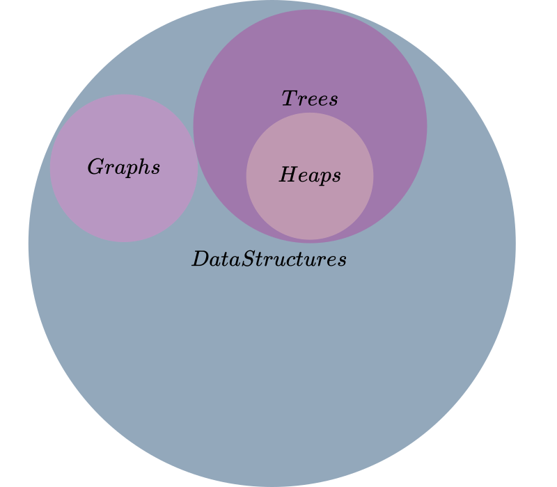
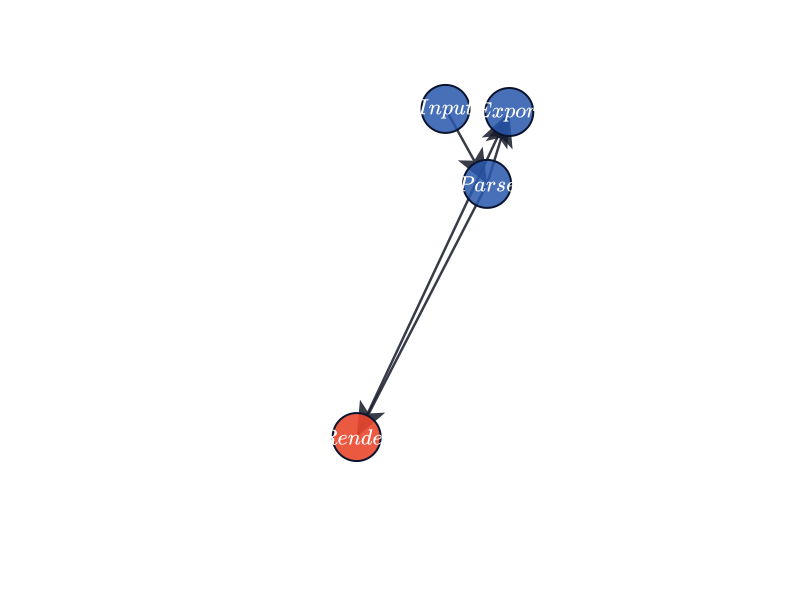
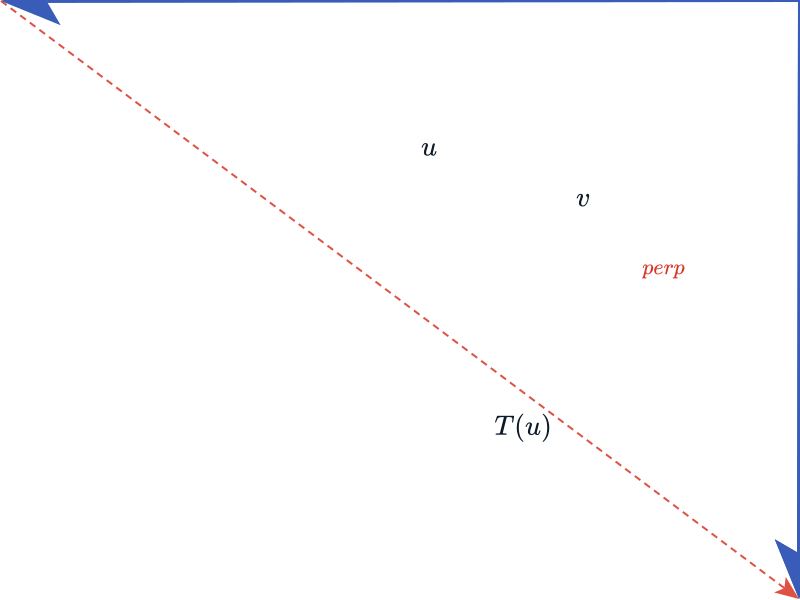

# Penrose SVG Skill

Penrose SVG Skill is a Codex skill for generating mathematically rigorous SVG diagrams through the official Penrose workflow. It helps AI coding agents write Penrose Domain, Substance, Style, and Trio JSON files, then render final SVG assets with the official `@penrose/roger` CLI.

The goal is to avoid fragile, hand-authored SVG generation. Instead, diagrams are expressed as structured mathematical logic plus reusable visual rules, and SVG output is treated as a reproducible build artifact.

## Background

[Penrose](https://penrose.cs.cmu.edu/) is a declarative diagramming system from Carnegie Mellon University for turning mathematical notation into diagrams. A Penrose diagram separates:

- **Domain**: abstract vocabulary such as types, functions, predicates, and constructors.
- **Substance**: concrete mathematical objects and relationships for one diagram.
- **Style**: visual rendering rules, layout constraints, shapes, labels, and canvas settings.
- **Trio JSON**: a small configuration file that ties Domain, Substance, and Style together for rendering.

This repository packages those workflow rules into a reusable Codex skill at:

```text
.codex/skills/penrose_svg/SKILL.md
```

## Source

The skill was created from the official Codex `skill-creator` workflow and validated against Penrose's public documentation and the official `@penrose/roger` CLI help.

Primary references:

- Official Penrose website: <https://penrose.cs.cmu.edu/>
- Official Penrose documentation: <https://penrose.cs.cmu.edu/docs/ref>
- Official Penrose GitHub repository: <https://github.com/penrose/penrose>
- Official renderer package: <https://www.npmjs.com/package/@penrose/roger>

## What This Skill Does

Use this skill when an AI agent needs to:

- Generate Penrose source files for mathematical or technical diagrams.
- Render SVG files through `@penrose/roger`.
- Build repeatable diagram workflows for academic papers, technical docs, courseware, blogs, and static sites.
- Enforce Penrose's separation of Domain, Substance, and Style.
- Avoid direct SVG source generation.

It is not intended for photorealistic imagery, generic decorative SVG art, or workflows where SVG markup is manually written as the source of truth.

## Repository Layout

```text
.
|-- README.md
|-- package.json
|-- examples/
|   |-- set-theory/
|   |-- directed-graph/
|   |-- geometry/
|   `-- vector-space/
`-- .codex/
    `-- skills/
        `-- penrose_svg/
            |-- SKILL.md
            `-- agents/
                `-- openai.yaml
```

## Environment Preparation

To render Penrose diagrams, install Node.js and use the official `@penrose/roger` package.

Check the CLI:

```bash
npx @penrose/roger --help
```

Optional global install:

```bash
npm i -g @penrose/roger
```

Recommended project-local install:

```bash
npm i -D @penrose/roger
```

This repository includes `@penrose/roger` as a dev dependency and a reproducible example-rendering script:

```bash
npm install
npm run render:examples
```

## Using the Skill in Codex

Place this repository where Codex can discover project-local skills, then invoke the skill explicitly:

```text
Use $penrose-svg to create a Penrose diagram of two disjoint subsets A and B inside a parent set C, renderable as SVG.
```

The skill instructs the agent to produce Penrose source files and render SVG through commands such as:

```bash
npx @penrose/roger trio --trio diagram.trio.json --out diagram.svg
```

For multiple diagrams:

```bash
npx @penrose/roger trios --trios diagrams/trios/*.trio.json --out public/diagrams
```

## Example Use Cases

The examples below are intentionally small. They show how a prompt becomes Penrose source files and then SVG output rendered by `@penrose/roger`. The SVG files are committed so readers can inspect the result without running the renderer first.

Penrose is not limited to one visual form such as Venn or Euler diagrams. Its core abstraction is domain modeling: define the mathematical or technical vocabulary in Domain, declare a concrete instance in Substance, and encode the visual grammar in Style. Official Penrose materials include domains such as geometry, sets, graphs, linear algebra, circuits, molecules, and word clouds, and users can define their own domains.

This README cannot exhaust every possible chart or diagram type. Instead, it includes representative examples across several domain families:

- Set relations and Euler-style containment
- Directed technical graphs
- Geometric point/segment diagrams
- Vector-space relation diagrams

Render all examples:

```bash
npm run render:examples
```

### 1. Academic Publishing: Disjoint Subsets

Prompt:

```text
Use $penrose-svg to create a publication-ready Euler-style diagram showing two disjoint subsets A and B inside a parent set C. Keep all logic in Penrose Domain and Substance files, all visual rules in Style, and render the final SVG with @penrose/roger.
```

Penrose files:

- [`disjoint-subsets.substance`](examples/set-theory/disjoint-subsets.substance)
- [`disjoint-subsets.trio.json`](examples/set-theory/disjoint-subsets.trio.json)
- [`disjoint-subsets.svg`](examples/set-theory/svg/disjoint-subsets.svg)

Rendered SVG:



Application scenario: use in a paper, lecture note, or documentation page where the logical claim is that `A` and `B` are disjoint subsets of `C`.

### 2. Courseware: Overlapping Mathematical Fields

Prompt:

```text
Use $penrose-svg to create a teaching diagram showing Algebra and Geometry as overlapping areas inside Topology. Generate valid Penrose source files and render the SVG only through @penrose/roger.
```

Penrose files:

- [`overlapping-fields.substance`](examples/set-theory/overlapping-fields.substance)
- [`overlapping-fields.trio.json`](examples/set-theory/overlapping-fields.trio.json)
- [`overlapping-fields.svg`](examples/set-theory/svg/overlapping-fields.svg)

Rendered SVG:



Application scenario: use in course slides, textbook notes, or blog posts where the diagram needs to preserve the distinction between subset and overlap relations.

### 3. Technical Documentation: Data Structure Taxonomy

Prompt:

```text
Use $penrose-svg to create a technical documentation diagram for a data-structure taxonomy: Trees and Graphs are disjoint subsets of DataStructures, and Heaps are a subset of Trees. Keep the generated SVG reproducible from Penrose source.
```

Penrose files:

- [`courseware-taxonomy.substance`](examples/set-theory/courseware-taxonomy.substance)
- [`courseware-taxonomy.trio.json`](examples/set-theory/courseware-taxonomy.trio.json)
- [`courseware-taxonomy.svg`](examples/set-theory/svg/courseware-taxonomy.svg)

Rendered SVG:



Application scenario: use in API docs, tutorials, or courseware where multiple diagrams can share the same Domain and Style while changing only Substance files.

### 4. System Workflow: Directed Graph

Prompt:

```text
Use $penrose-svg to create a directed graph for a technical pipeline: Input flows to Parse, Parse flows to Render, Render flows to Export, and Parse can also flow directly to Export. Highlight Render as the active stage. Generate Penrose source and render the SVG only with @penrose/roger.
```

Penrose files:

- [`graph.domain`](examples/directed-graph/graph.domain)
- [`network.style`](examples/directed-graph/network.style)
- [`pipeline.substance`](examples/directed-graph/pipeline.substance)
- [`pipeline.trio.json`](examples/directed-graph/pipeline.trio.json)
- [`pipeline.svg`](examples/directed-graph/svg/pipeline.svg)

Rendered SVG:



Application scenario: use in architecture notes, compiler pipeline explanations, workflow diagrams, or dependency graphs.

### 5. Geometry: Triangle From Points and Segments

Prompt:

```text
Use $penrose-svg to create a geometry diagram with three points A, B, and C, connected by segments AB, BC, and CA, with a filled triangular face. Keep point and segment declarations in Penrose source and render the SVG with @penrose/roger.
```

Penrose files:

- [`geometry.domain`](examples/geometry/geometry.domain)
- [`triangle.style`](examples/geometry/triangle.style)
- [`triangle.substance`](examples/geometry/triangle.substance)
- [`triangle.trio.json`](examples/geometry/triangle.trio.json)
- [`triangle.svg`](examples/geometry/svg/triangle.svg)

Rendered SVG:


Application scenario: use in Euclidean geometry notes, mathematical exposition, and theorem illustrations where points and relations remain explicit.

### 6. Linear Algebra: Vector-Space Relation

Prompt:

```text
Use $penrose-svg to create a vector-space diagram with vectors u, v, and T(u), marking u and v as orthogonal and drawing a dashed map from u to T(u). Keep the vector relation in Substance and render the SVG through @penrose/roger.
```

Penrose files:

- [`vector.domain`](examples/vector-space/vector.domain)
- [`vector.style`](examples/vector-space/vector.style)
- [`orthogonal-map.substance`](examples/vector-space/orthogonal-map.substance)
- [`orthogonal-map.trio.json`](examples/vector-space/orthogonal-map.trio.json)
- [`orthogonal-map.svg`](examples/vector-space/svg/orthogonal-map.svg)

Rendered SVG:



Application scenario: use in linear algebra teaching materials, papers, or notes where vector relations should remain part of the source model.

## Workflow Summary

1. Decompose the diagram into mathematical objects and relationships.
2. Generate Penrose Domain, Substance, Style, and Trio JSON files.
3. Validate syntax and logical consistency.
4. Render with the official `@penrose/roger` CLI.
5. Refine only Penrose source files, not generated SVG.
6. Commit both source files and rendered assets when the project tracks generated diagrams.

## License

This project is released under the MIT License. See [LICENSE](LICENSE).
