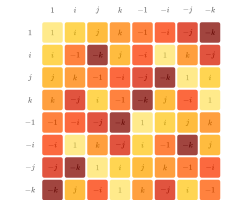
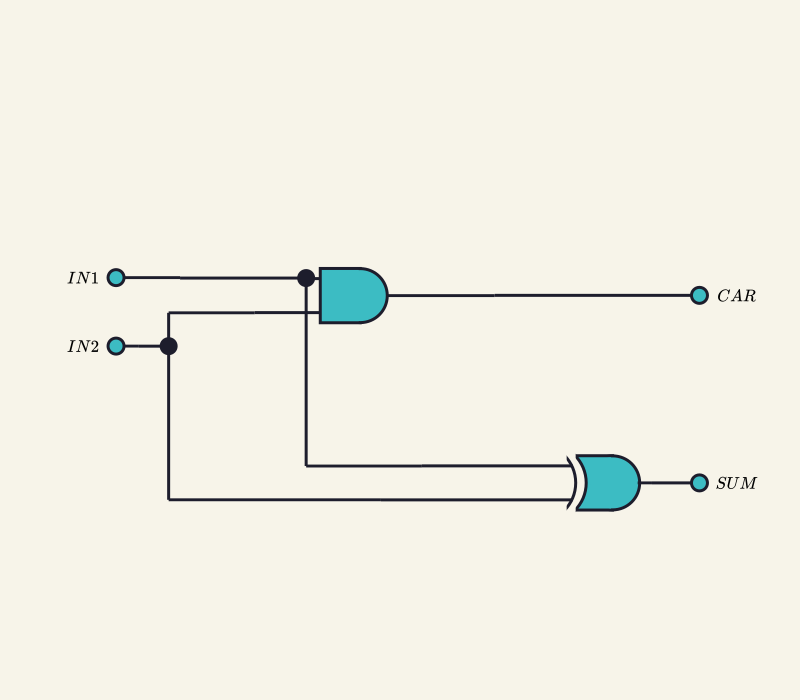

# Penrose SVG Skill

Penrose SVG Skill is a Codex skill for generating mathematically rigorous SVG diagrams through the official Penrose workflow. It helps AI coding agents write Penrose Domain, Substance, Style, and Trio JSON files, then render final SVG assets with the official `@penrose/roger` CLI.

The goal is to avoid fragile, hand-authored SVG generation. Instead, diagrams are expressed as structured mathematical logic plus reusable visual rules, and SVG output is treated as a reproducible build artifact.

## Background

[Penrose](https://penrose.cs.cmu.edu/) is a declarative diagramming system from Carnegie Mellon University for turning mathematical notation into diagrams. A Penrose diagram separates:

- **Domain**: abstract vocabulary such as types, functions, predicates, and constructors.
- **Substance**: concrete mathematical objects and relationships for one diagram.
- **Style**: visual rendering rules, layout constraints, shapes, labels, and canvas settings.
- **Trio JSON**: a small configuration file that ties Domain, Substance, and Style together for rendering.

This repository packages those workflow rules into a reusable Codex skill at:

```text
.codex/skills/penrose_svg/SKILL.md
```

## Source

The skill was created from the official Codex `skill-creator` workflow and validated against Penrose's public documentation and the official `@penrose/roger` CLI help.

Primary references:

- Official Penrose website: <https://penrose.cs.cmu.edu/>
- Official Penrose documentation: <https://penrose.cs.cmu.edu/docs/ref>
- Official Penrose GitHub repository: <https://github.com/penrose/penrose>
- Official renderer package: <https://www.npmjs.com/package/@penrose/roger>

## What This Skill Does

Use this skill when an AI agent needs to:

- Generate Penrose source files for mathematical or technical diagrams.
- Render SVG files through `@penrose/roger`.
- Build repeatable diagram workflows for academic papers, technical docs, courseware, blogs, and static sites.
- Enforce Penrose's separation of Domain, Substance, and Style.
- Avoid direct SVG source generation.

It is not intended for photorealistic imagery, generic decorative SVG art, or workflows where SVG markup is manually written as the source of truth.

## Repository Layout

```text
.
|-- README.md
|-- package.json
|-- examples/
|   |-- set-theory/
|   |-- directed-graph/
|   |-- geometry/
|   |-- group-theory/
|   |-- logic-circuit/
|   `-- vector-space/
`-- .codex/
    `-- skills/
        `-- penrose_svg/
            |-- SKILL.md
            `-- agents/
                `-- openai.yaml
```

## Environment Preparation

To render Penrose diagrams, install Node.js and use the official `@penrose/roger` package.

Check the CLI:

```bash
npx @penrose/roger --help
```

Optional global install:

```bash
npm i -g @penrose/roger
```

Recommended project-local install:

```bash
npm i -D @penrose/roger
```

This repository includes `@penrose/roger` as a dev dependency and a reproducible example-rendering script:

```bash
npm install
npm run render:examples
```

## Using the Skill in Codex

Place this repository where Codex can discover project-local skills, then invoke the skill explicitly:

```text
Use $penrose-svg to create a Penrose diagram of two disjoint subsets A and B inside a parent set C, renderable as SVG.
```

The skill instructs the agent to produce Penrose source files and render SVG through commands such as:

```bash
npx @penrose/roger trio --trio diagram.trio.json --out diagram.svg
```

For multiple diagrams:

```bash
npx @penrose/roger trios --trios diagrams/trios/*.trio.json --out public/diagrams
```

## Example Use Cases

The examples below are intentionally small. They show how a prompt becomes Penrose source files and then SVG output rendered by `@penrose/roger`. The SVG files are committed so readers can inspect the result without running the renderer first.

Penrose is not limited to one visual form such as Venn or Euler diagrams. Its core abstraction is domain modeling: define the mathematical or technical vocabulary in Domain, declare a concrete instance in Substance, and encode the visual grammar in Style. Official Penrose materials include domains such as geometry, sets, graphs, linear algebra, circuits, molecules, and word clouds, and users can define their own domains.

This README cannot exhaust every possible chart or diagram type. Instead, it first summarizes the official gallery examples by domain, then shows representative local examples in a compact three-column table.

Render all examples:

```bash
npm run render:examples
```

### Official Gallery Coverage

The official gallery at [`penrose.cs.cmu.edu/examples`](https://penrose.cs.cmu.edu/examples) currently links the following 53 examples. The table below groups the official example slugs by broad domain so readers can see that Penrose covers far more than set diagrams.

| Domain family | Official example slugs |
| --- | --- |
| Set and category-style relations | `set-theory-domain/tree-euler`, `set-theory-domain/tree-euler-3d`, `set-theory-domain/continuousmap`, `set-potatoes/non-surjection-not-epimorphism` |
| Algebra, group theory, and linear algebra | `group-theory/quaternion-multiplication-table`, `group-theory/quaternion-cayley-graph`, `exterior-algebra/vector-wedge`, `lagrange-bases/lagrange-bases`, `matrix-ops/tests/matrix-matrix-multiplication` |
| Graphs, spectral graphs, and hypergraphs | `spectral-graphs/examples/hypercube`, `spectral-graphs/examples/hexagonal-lattice`, `spectral-graphs/examples/dodecahedral-graph`, `spectral-graphs/examples/mobius`, `graph-domain/textbook/sec1/fig5`, `graph-domain/other-examples/hamiltonian-cycle`, `graph-domain/other-examples/arpanet`, `hypergraph/hypergraph` |
| Geometry, curves, meshes, and impossible objects | `geometry-domain/textbook_problems/c11p12`, `geometry-domain/siggraph-teaser`, `curve-examples/catmull-rom/catmull-rom`, `curve-examples/blobs`, `triangle-mesh-2d/diagrams/cotan-formula`, `triangle-mesh-2d/diagrams/concyclic-pair`, `triangle-mesh-3d/two-triangles`, `mobius/mobius`, `impossible-ngon/ngon`, `envelopes/nephroid` |
| Topology and topological data analysis | `persistent-homology/persistent-homology` |
| Physics, probability, stochastic processes, and geometric queries | `walk-on-spheres/SignedAngleOutside`, `walk-on-spheres/walk-on-stars`, `walk-on-spheres/laplace-estimator`, `stochastic-process/stochastic-process`, `stochastic-process/epsilon-shell/AbsorbingBoundary`, `ray-tracing/next-event-estimation`, `geometric-queries/ray-intersect/test-group`, `geometric-queries/test`, `geometric-queries/closest-point/test-group`, `Dynamics/Lyapunov` |
| Chemistry, circuits, and technical systems | `structural-formula/molecules/caffeine`, `structural-formula/reactions/methane-combustion`, `logic-circuit-domain/half-adder`, `box-arrow-diagram/computer-architecture` |
| Graphics, fractals, and sampling | `dinoshade/dinoshade`, `random-sampling/test`, `fractals/chaos-game/sierpinski-triangle`, `fractals/ifs/ifs` |
| Text, data visualization, arrays, and interactivity | `word-cloud/example`, `fancy-text/fancy-text`, `dataviz/linearreg`, `array-models/insertionSort`, `interactive/ellipse-rays`, `interactive/viewport`, `interactive/planets` |

### Local Representative Examples

These local examples are intentionally compact and are arranged in three columns so the README stays scannable. Several examples are simplified originals; the group-theory and logic-circuit examples are source-compatible reproductions of the official gallery examples [`group-theory/quaternion-multiplication-table`](https://penrose.cs.cmu.edu/try/?examples=group-theory/quaternion-multiplication-table) and [`logic-circuit-domain/half-adder`](https://penrose.cs.cmu.edu/try/?examples=logic-circuit-domain/half-adder).

| Set relations | Group theory | Logic circuits |
| --- | --- | --- |
|  |  |  |
| Prompt: `Use $penrose-svg to create a publication-ready Euler-style diagram showing two disjoint subsets A and B inside a parent set C.`<br>Files: [`substance`](examples/set-theory/disjoint-subsets.substance), [`trio`](examples/set-theory/disjoint-subsets.trio.json), [`svg`](examples/set-theory/svg/disjoint-subsets.svg) | Prompt: `Use $penrose-svg to create a quaternion multiplication table in the style of the official Penrose group-theory gallery example.`<br>Files: [`domain`](examples/group-theory/Group.domain), [`style`](examples/group-theory/MultiplicationTable.style), [`substance`](examples/group-theory/groups/quaternions.substance), [`trio`](examples/group-theory/quaternion-multiplication-table.trio.json), [`svg`](examples/group-theory/svg/quaternion-multiplication-table.svg) | Prompt: `Use $penrose-svg to create a half-adder logic circuit with XOR and AND gates, matching the official logic-circuit-domain gallery pattern.`<br>Files: [`domain`](examples/logic-circuit/logic-gates.domain), [`style`](examples/logic-circuit/half-adder-color.style), [`substance`](examples/logic-circuit/half-adder.substance), [`trio`](examples/logic-circuit/half-adder.trio.json), [`svg`](examples/logic-circuit/svg/half-adder.svg) |

| Directed graph | Geometry | Linear algebra |
| --- | --- | --- |
|  |  |  |
| Prompt: `Use $penrose-svg to create a directed graph for a technical pipeline: Input flows to Parse, Parse flows to Render, Render flows to Export, and Parse can also flow directly to Export.`<br>Files: [`domain`](examples/directed-graph/graph.domain), [`style`](examples/directed-graph/network.style), [`substance`](examples/directed-graph/pipeline.substance), [`trio`](examples/directed-graph/pipeline.trio.json), [`svg`](examples/directed-graph/svg/pipeline.svg) | Prompt: `Use $penrose-svg to create a geometry diagram with three points A, B, and C, connected by segments AB, BC, and CA, with a filled triangular face.`<br>Files: [`domain`](examples/geometry/geometry.domain), [`style`](examples/geometry/triangle.style), [`substance`](examples/geometry/triangle.substance), [`trio`](examples/geometry/triangle.trio.json), [`svg`](examples/geometry/svg/triangle.svg) | Prompt: `Use $penrose-svg to create a vector-space diagram with vectors u, v, and T(u), marking u and v as orthogonal and drawing a dashed map from u to T(u).`<br>Files: [`domain`](examples/vector-space/vector.domain), [`style`](examples/vector-space/vector.style), [`substance`](examples/vector-space/orthogonal-map.substance), [`trio`](examples/vector-space/orthogonal-map.trio.json), [`svg`](examples/vector-space/svg/orthogonal-map.svg) |

| Set taxonomy | Mathematical overlap | Courseware containment |
| --- | --- | --- |
|  |  |  |
| Prompt: `Use $penrose-svg to create a technical documentation diagram for a data-structure taxonomy: Trees and Graphs are disjoint subsets of DataStructures, and Heaps are a subset of Trees.`<br>Files: [`substance`](examples/set-theory/courseware-taxonomy.substance), [`trio`](examples/set-theory/courseware-taxonomy.trio.json), [`svg`](examples/set-theory/svg/courseware-taxonomy.svg) | Prompt: `Use $penrose-svg to create a teaching diagram showing Algebra and Geometry as overlapping areas inside Topology.`<br>Files: [`substance`](examples/set-theory/overlapping-fields.substance), [`trio`](examples/set-theory/overlapping-fields.trio.json), [`svg`](examples/set-theory/svg/overlapping-fields.svg) | Prompt: `Use $penrose-svg to reuse the set Domain and Euler Style for another containment or disjointness claim.`<br>Shared files: [`domain`](examples/set-theory/setTheory.domain), [`style`](examples/set-theory/euler.style), [`svg`](examples/set-theory/svg/disjoint-subsets.svg) |

## Workflow Summary

1. Decompose the diagram into mathematical objects and relationships.
2. Generate Penrose Domain, Substance, Style, and Trio JSON files.
3. Validate syntax and logical consistency.
4. Render with the official `@penrose/roger` CLI.
5. Refine only Penrose source files, not generated SVG.
6. Commit both source files and rendered assets when the project tracks generated diagrams.

## License

This project is released under the MIT License. See [LICENSE](LICENSE).
